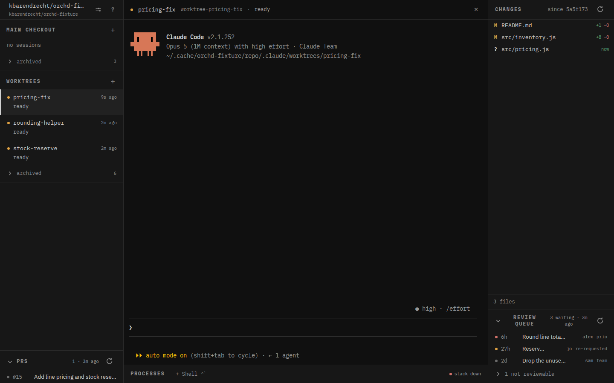

# orchestrator

Run several Claude Code sessions over one repository, from a single window — and
see at a glance which ones are working, which are waiting on you, and which of
your PRs have review threads to answer.

Each session lives in its own git worktree with its own terminal. The daemon owns
every process, so closing the window kills nothing you did not mean to and losing
the browser tab loses nothing at all. Beside the sessions it polls your open PRs,
lists the reviews waiting on you, and drives a review-resolve flow that drafts
replies you approve before anything is posted.



## What it is

A Rust daemon plus a small vanilla-JS web app, shipped as one desktop application
(the daemon runs in-process behind a webview) and also runnable headless in a
browser tab. It hosts [Claude Code](https://www.anthropic.com/claude-code)
sessions; it is not itself an agent.

The pieces:

- **A pty host.** Every session and managed process runs in a daemon-owned pty
  with a replayable scrollback buffer. The web UI is a disposable view of it —
  close it, reopen it, attach from a second window; nothing restarts.
- **A session board.** Spawn a session in the main checkout or in a fresh
  worktree. A state machine (driven by Claude Code's hooks) shows each as
  working, waiting on you, or done, with the build status of any process beside
  it folded in.
- **A PR pane.** Your open PRs, polled from GitHub, with review-thread counts and
  a one-click resolve flow.
- **A review queue.** Optionally, the PRs where your review is requested, ranked
  by a command you configure.
- **A diff viewer** against the merge-base, with an editable pane that warns the
  agent when you have changed a file under it.

## Install

Releases attach two binaries per platform.

- **`orchestrator-desktop`** is the app. The daemon and the web UI are compiled
  into it, so this one binary on its own is a complete install.
- **`orch` is optional.** A small CLI against a running daemon: `orch new` starts
  another session with a prompt, `orch ask` puts a question in front of you and
  blocks until you answer, `orch ls` lists what is running. Useful from your own
  shell, and it is how an *agent* reaches the daemon that spawned it — a session
  can open a helper session for a subtask, or ask you something and wait rather
  than bury the question in its own scrollback. Nothing requires it.

Apple Silicon and x86-64 Linux are built.

### Through mise (with the `ubi` backend)

```
mise use -g "ubi:kbarendrecht/orchestrator[exe=orchestrator-desktop]"
mise up          # upgrade to the newest release later
```

`ubi` picks the right asset for your platform. If you want the optional `orch`
CLI as well, add a second entry with `[exe=orch]`.

### From a release tarball

```
tar -xzf orchestrator-<version>-<platform>.tar.gz   # → orchestrator-desktop, orch
# macOS: the binaries are unsigned, so clear the download quarantine first
xattr -dr com.apple.quarantine orchestrator-desktop orch
```

Put them on your `PATH` (`orch` only if you want it) and run
`orchestrator-desktop`.

**Linux** needs **WebKitGTK 4.1** at runtime (Ubuntu 22.04 / Debian 12 or newer;
20.04 ships only 4.0 and will not work). **macOS** uses the system WebView and
needs nothing extra.

> **Honesty about macOS:** the macOS build compiles and its daemon tests pass in
> CI, but nobody has launched the app on a Mac yet. Treat the first run as the
> test. Everything below is exercised daily on Linux.

Then launch it and point it at a git checkout when it asks (it shows a folder
picker when it has no config, or when the one on record has moved). That checkout
is *main*; worktrees are cut inside it under `.claude/worktrees/`. State lives in
`~/.config/orchd/` on Linux and `~/Library/Application Support/orchd/` on macOS —
move it with `ORCHD_CONFIG_DIR`.

## What it assumes about your repo

The defaults are the author's own monorepo ("acme"), not generic ones, because
that is the one repo it runs against every day. Everything here is editable in the
settings panel and written back to `config.json`; changes take effect on restart.

| Setting | Default (acme's) | What it is |
| --- | --- | --- |
| `upstream_ref` / `upstream_remote` | `upstream/develop`, `upstream` | the base every diff and worktree is measured against — a fork workflow. A repo that merges to its origin's default branch sets `origin/HEAD` / `origin`. |
| `tracker` | `shortcut` | where an out-of-scope review point can be filed as a story. `none` disables it. |
| `output_language` | `Dutch` | the language the agent *writes* replies and stories in. Prompts and code stay English. |
| `reviews_command` | `mise run reviews --json` | prints the review queue as JSON (shape in `docs/reviews-json.md`). Empty = no queue. |
| `main_processes` | `ng-watch`, `docker` | long-running processes shown in the drawer, both `autostart:false`. Empty for a repo that has none. |
| `worktree_setup` | *(empty)* | a command run in every worktree the daemon cuts itself, for repos whose `WorktreeCreate` hook does setup that PR/resumed worktrees would otherwise miss. |

So a acme checkout can write just `{ "main_checkout": "…" }` and inherit the
rest; anyone else edits these to match their repo. A plain checkout with the
tracker off and no reviews command still gets the session board, PR pane, diff
viewer and worktrees — the review-resolve flow is what leans on the settings.

Two things a fresh checkout needs once, both one-time: accept Claude Code's
workspace-trust prompt for it (or `claude --worktree` refuses), and — if you
develop orchd — `git config core.hooksPath .githooks`.

## How it works

- **One process.** `desktop/` is a [Tauri](https://v2.tauri.app/) v2 shell around
  the daemon as a library: `orchd::start` binds a loopback port and the webview is
  pointed at it. No sidecar, no fixed port, nothing left running. The window is
  frameless and the web UI draws its own titlebar (real traffic lights on macOS);
  window controls go over the same authenticated HTTP as everything else, never
  Tauri IPC.
- **Sessions are the daemon's.** It spawns every one with `--session-id`, so its
  own id and Claude Code's are the same value and hook correlation needs no
  mapping. It never adopts a shell-started session — that exactness is the point.
- **Hooks drive the state.** Claude Code's hooks (`SessionStart`, `PostToolUse`,
  `Stop`, `SessionEnd`, …) POST to the daemon, which is how a row knows whether it
  is working or waiting. The daemon's hook settings *merge* with the repo's own,
  so your project hooks keep firing.
- **Worktrees.** At Claude Code's default layout the daemon launches
  `claude --worktree` and the repo's own worktree hooks do the work; for PR
  worktrees, resumes, and relocated layouts it cuts the tree itself with
  `git worktree add` and runs `worktree_setup`. Teardown is a six-check preflight
  and `git worktree remove` only — never `rm -rf`, because a worktree is full of
  symlinks into main.
- **The review flow.** Triage reads a PR's open threads and proposes, per thread,
  a stance and whether code changes; a run commits per thread and drafts a reply
  you see beside the real diff before the daemon posts it on its own credentials.
  Resolving a thread stays your button, by design.
- **`fix-pr` is hand-triggered, never automatic.** The guards that protect the
  machine and the repo remain (authorship, one run per PR, a concurrency cap,
  push guards that deny `-u`, bare `--force`, and protected refs); the automatic
  trigger does not. It is a gate you read before starting, not one that trips
  while you look elsewhere.

The web UI is compiled into the binary with `include_str!`, so it can never drift
from the daemon serving it — and a change under `web/` needs a rebuild.

## Security

Bound to `127.0.0.1` only, with Origin/Host validation and a per-start token
required on the WebSocket and every mutating route. Hook endpoints are exempt
from the token but confined to their own prefix and can only ever update state.
GitHub auth resolves `ORCHD_GITHUB_TOKEN`, then a `0600` `github_token_file`, then
`gh auth token`; read scopes are all it needs.

## Layout

```
src/
  lib.rs        wiring, the router, the pollers, startup recovery, SPA serving
  main.rs       the headless CLI over the library; desktop/ is the other caller
  config.rs     config file, defaults, Settings read/write, transcript slug
  model.rs      Workspace / Session / Process, State, ArchiveState
  state.rs      the daemon's owned state, snapshots, reconcile, durable-store writes
  instance.rs   the one-daemon-at-a-time pid lock
  headroom.rs   the pre-spawn resource check every session goes through
  window.rs     Chrome, and the handle the desktop shell registers
  pty.rs        portable-pty host      ring.rs   scrollback
  proc.rs       run a child with a deadline, portably (no coreutils `timeout`)
  hooks.rs      hook receiver and the generated settings file
  spawn.rs      session / worktree / process spawning, and worktree_setup
  health.rs     a managed process's output → health
  diff.rs       numstat, hunk parsing, word-level LCS
  edit.rs       file read/write with containment and conflict detection
  git.rs        status parsing, refs, unpushed, worktree ops, the review writes
  review_commit.rs  which commit a batch's work may be folded into
  forge/        the Forge seam: trait + dispatch (mod.rs), agnostic model
                (model.rs), the GitHub impl (github.rs, github_write.rs)
  triage.rs     the triage run, and the gates a worktree must pass first
  proposal.rs   what triage proposes: Stance × Mode, positions, patches, stories
  post.rs       the review batch end to end
  patch.rs      applying and committing what you approved, with staleness checks
  prompt.rs     rendering the vendored prompts in commands/
  story.rs      filing a tracker story for a fair-but-out-of-scope point
  reviews.rs    review queue: runs reviews_command, parses JSON, degraded states
  fix_pr.rs     automation state, the fix-pr guard table, a run's verdict
  agent_update.rs   is Claude Code behind (via mise), and the one-click upgrade
  worktree.rs   teardown preflight, archive, revive, removal
  store.rs      session record persistence, orphan reaping
  api.rs        HTTP surface and the origin/token guards      ws.rs  event stream + pty attach
  todo.rs       the generated findings block in TODO.md
web/            the SPA (vanilla, xterm.js vendored) — one module graph under js/,
                booted by app.js; snapshot.d.ts is generated from the Rust structs
guards/push.py  PreToolUse deny for dangerous pushes
```

## Developing

```
mise install
git config core.hooksPath .githooks      # once per clone
cargo test                               # the daemon
mise run check-web                       # type-check the SPA + its module graph
cargo run -p orchestrator-desktop        # the app, daemon embedded
mise run shot                            # screenshot the running app (drives Chrome)
mise run fixture                         # a throwaway PR to drive the review flow
```

Prefer a terminal, or debugging the daemon itself? Run it headless and open the
printed URL, which carries a per-start token. The release ships the app and
`orch`, not this binary, and it shares the app's config:

```
cargo run -p orchd -- --main /path/to/your/repo
```

The app runs in **WebKitGTK**, so `mise run shot` (Chrome) is good for layout but
not the last word — the two engines disagree often enough to matter.
[`CLAUDE.md`](CLAUDE.md) has the working notes and the traps worth knowing;
[`TODO.md`](TODO.md) is the living record of what is open, with a block the daemon
rewrites each poll. The `(§N)` scattered through the comments point at
[`docs/spec.md`](docs/spec.md), the requirements this was built against — §2 is
the object model, §6b the review queue, §8 the automation rules.

Versions are CalVer (`year.month.n`). Cut a release by bumping `Cargo.toml`,
`desktop/Cargo.toml`, `desktop/tauri.conf.json` and `Cargo.lock`, then tagging
`v<version>` — the workflow refuses a tag that disagrees with the crate version.

## Licence

[AGPL-3.0-only](LICENSE). Use it, run it, change it. If you distribute it, or run
a modified version as a network service, the source has to go with it under the
same terms.
