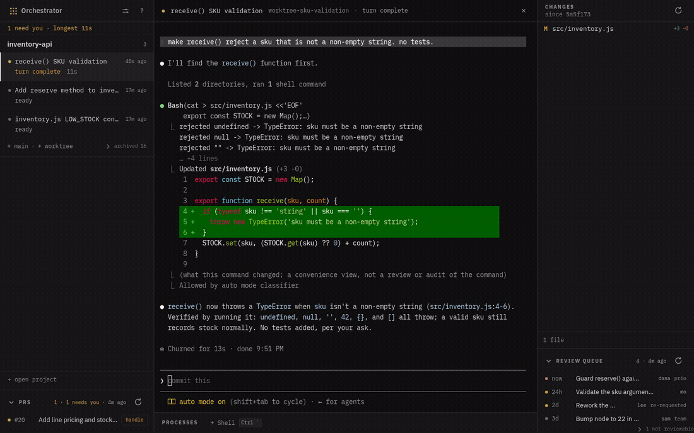
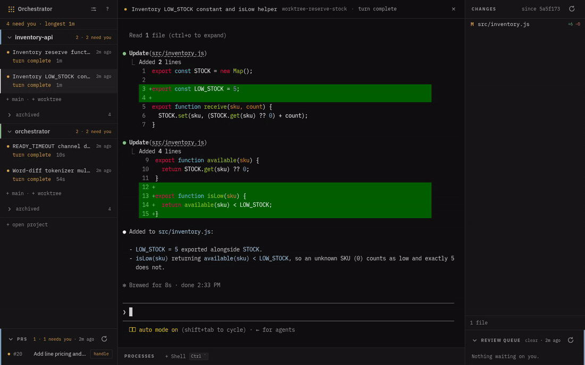
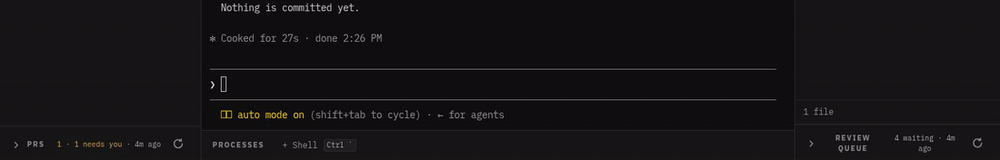
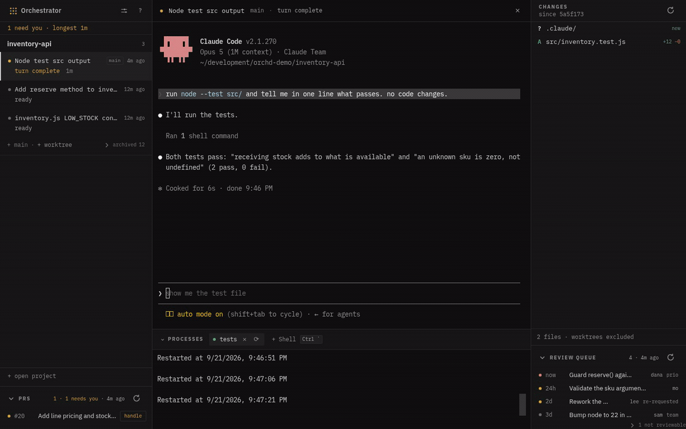
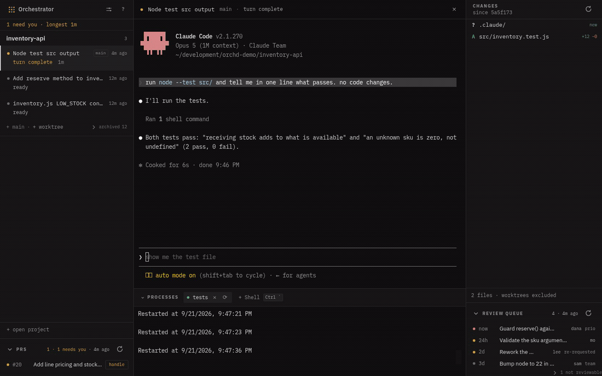
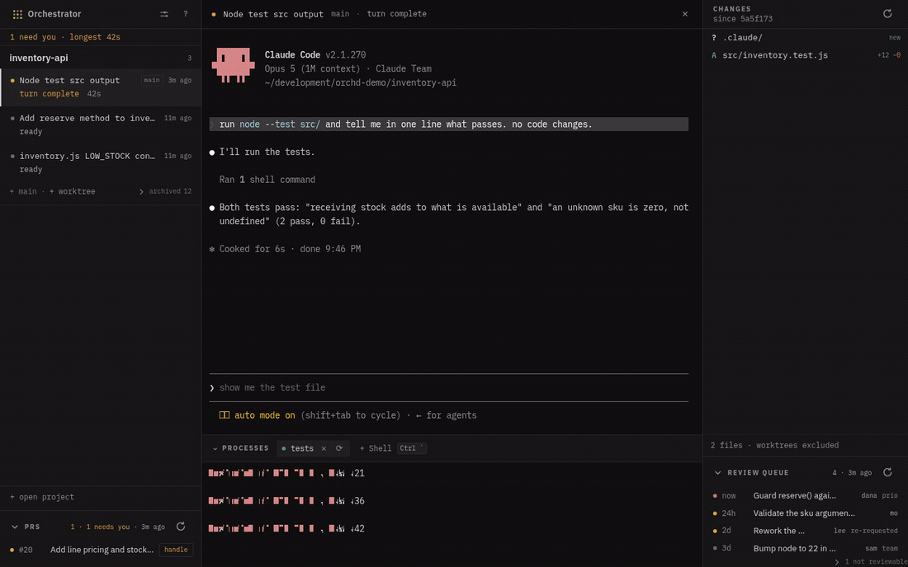
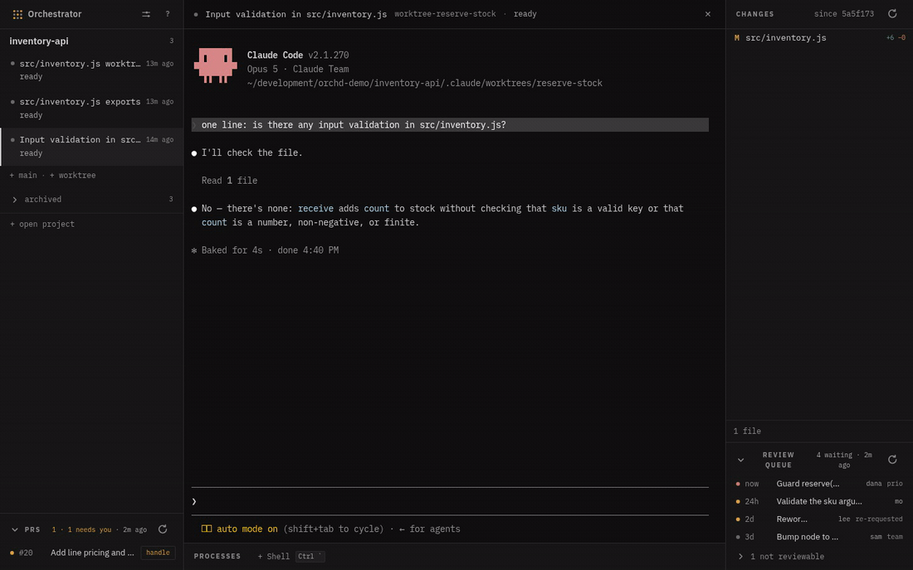

# orchestrator

[](https://github.com/kbarendrecht/orchestrator/releases/latest)
[](https://github.com/kbarendrecht/orchestrator/actions/workflows/check.yml)
[](LICENSE)


Run several Claude Code sessions over one repository, from a single window — and
see at a glance which ones are working, which are waiting on you, and which of
your or your repository's PRs need attention.



Each session lives in its own git worktree with its own terminal. The daemon owns
every process, so closing the window kills nothing you did not mean to and losing
the browser tab loses nothing at all. Beside the sessions it polls your open PRs,
lists the reviews waiting on you, and drives a review-resolve flow that drafts
replies you approve before anything is posted.

## What it does

Each row is real: the agents are Claude Code, the diffs are what they wrote.
[`docs/demo.md`](docs/demo.md) says how the recordings are made.

| | |
| --- | --- |
| **Several repositories, one window.** Each checkout keeps its own sessions, changed files and PRs, and the panes swap with the row you click. |  |
| **The PRs, and the reviews you owe.** Every open PR with the threads still waiting on you, and a queue of other people's PRs ranked by who is blocked. The queue rows are demo data — [why](docs/demo.md). |  |
| **A diff you can edit.** Changed files against the merge-base, word-level. The pane is editable, and the agent is told when you have changed a file under it. |  |
| **Find, read, jump.** Search a workspace with ripgrep's engine, open a hit in its own file pane, and modifier-click a path or a symbol to go there. |  |
| **Processes beside the agents.** A build watcher or a container stack in the drawer, with its health folded into the rail beside the session that broke it. |  |
| **Nothing dies with the window.** The daemon owns every pty. Close the window, lose the tab, kill the daemon outright — the sessions come back with their conversations. |  |

Under it: a Rust daemon plus a small vanilla-JS web app, shipped as one desktop
application and also runnable headless in a browser tab. It hosts
[Claude Code](https://www.anthropic.com/claude-code) sessions; it is not itself an
agent. [`docs/architecture.md`](docs/architecture.md) is how the pieces fit.

## What you need

| What | Why |
| --- | --- |
| **Claude Code** (`claude` on `PATH`, signed in) | The daemon spawns it for every session. Without it a session exits the instant it starts, so the daemon says so at boot rather than letting you find out that way. |
| **git** | Worktrees, branch moves, diffs — all of it. |
| **WebKitGTK 4.1** (Linux only) | The desktop window. Ubuntu 22.04 / Debian 12 or newer; 20.04 ships 4.0 and will not work. macOS uses the system WebView. |
| **`gh`**, signed in | Reads go out with `curl`, and for those `github_token_file` replaces it. Every write (a thread reply, a 👍, a re-requested review) shells `gh` and uses its credential, so the resolve flow wants it. |

A fresh checkout also needs Claude Code's **workspace trust**, accepted once in
its dialog. Until then sessions die on spawn.

Nothing here is checked at install time. The daemon checks at **boot**, names what
is missing and what stops working, and starts anyway.

## Install

```
brew install --cask kbarendrecht/tap/orchestrator   # macOS, Apple Silicon
mise use -g github:kbarendrecht/orchestrator        # anywhere
```

On Debian and Ubuntu, from the apt repository:

```
curl -fsSL https://kbarendrecht.github.io/apt/orchestrator.asc \
  | sudo tee /usr/share/keyrings/orchestrator.asc > /dev/null
echo "deb [arch=amd64 signed-by=/usr/share/keyrings/orchestrator.asc] https://kbarendrecht.github.io/apt stable main" \
  | sudo tee /etc/apt/sources.list.d/orchestrator.list > /dev/null
sudo apt update && sudo apt install orchestrator
```

Each of those installs the app, the `orchd` daemon it runs per checkout, and the
`orch` CLI. **All three upgrade from inside the app**: when a release lands, the
bar at the top carries an Upgrade button that runs your own channel's command —
`mise upgrade`, `brew upgrade --cask`, or apt behind a password prompt — and then
a Restart button, because the running process is the old build until it goes. A
downloaded `.dmg`, AppImage or tarball gets the release link instead, since there
is no installer to ask. The
[release page](https://github.com/kbarendrecht/orchestrator/releases/latest) also
attaches a `.dmg`, a `.deb`, an AppImage and a tarball for anyone who would rather
download one. Apple Silicon and x86-64 Linux are built.

Launch it and point it at a git checkout when it asks. That checkout is *main*;
worktrees are cut inside it under `.claude/worktrees/`. State lives in
`~/.config/orchd/` on Linux and `~/Library/Application Support/orchd/` on macOS —
move it with `ORCHD_CONFIG_DIR`.

A mise or tarball install has no launcher entry until the app writes one, so
**run `orchestrator-desktop` once from a terminal**: that first launch puts it in
Finder, Spotlight or your application menu. `orchestrator-desktop
--install-desktop-entry` writes it again after a move.

`orch` is optional and nothing requires it: `orch new` starts a session with a
prompt, `orch ask` puts a question in front of you and blocks, `orch ls` lists
what is running. Every session is told it is there, so an agent reaches for it
without being prompted.

## Configuring it for your repo

The defaults ask nothing of the repo you point at: no review-queue command, no
managed processes, no tracker. You get the session board, PR pane, diff viewer and
worktrees on a bare `{ "main_checkout": "…" }`, and you turn the rest on as your
repo can support it. Everything here is editable in the settings panel and written
back to `config.json`; changes take effect on restart.

| Setting | Default | What it is |
| --- | --- | --- |
| `upstream_ref` / `upstream_remote` | `origin/HEAD`, `origin` | the base every diff and worktree is measured against. On a **fork workflow** — an `upstream` remote beside `origin` — a first run detects it and writes `upstream/<default branch>` instead, so there is nothing to set by hand. |
| `reviews_command` | *(empty — the built-in queue)* | argv printing the review queue as JSON. See below. Empty means the daemon builds the queue itself; set it to use your team's own ranking. |
| `main_processes` | *(empty)* | long-running processes shown in the drawer. See below. |
| `tracker` | `none` | where an out-of-scope review point can be filed as a story. Three fields — `mcp_server`, `host` and an optional `token_env` — so pointing it at another tracker is a config edit rather than a release. Its token is **not** a config key — set `ORCHD_TRACKER_TOKEN` in the daemon's environment, or let `env_source` read the checkout's own. It also needs the repo to declare a matching **MCP server** — see below. |
| `env_source` | `mise` | which tool is asked what a session's own directory exports — `mise`, `direnv`, or `none`. Config file only, not in the settings panel. See below. |
| `default_language` | `English` | the language the agent *writes* replies and stories in. Prompts and code stay English regardless. |
| `shared_worktree_paths` | *(empty)* | directories inside a worktree that are allowed to be symlinks *out* of it, e.g. a plan dir shared back to main. The editable diff pane refuses every other path that resolves outside the workspace. |
| `worktree_init` / `worktree_setup` | *(empty)* | two commands run in every worktree the daemon cuts itself. See below. |
| `worktree_retention_days` | `60` | remove the worktree of a conversation not worked in for this many days, hourly, and one that no conversation points at at all. Age is the transcript's last write, not the session's start, so a conversation you kept open for weeks is not old the day after you stop; an orphaned tree is dated by its own directory. **The tree, never the row**: the session stays in the rail and a resume rebuilds the tree, so this reclaims disk rather than losing work, and it removes nothing the teardown preflight would refuse — a dirty tree, an unpushed commit, a live session or a running process all keep it. `0` turns it off. It exists because `claude --worktree` removes its own tree when its session ends and never gets to: the daemon owns the pty and kills it. |

The table above is the set most repos touch. The rest are operational, and most
repos leave them at the default:

| Setting | Default | What it is |
| --- | --- | --- |
| `main_checkout` | *(required)* | the privileged checkout the daemon manages. The one key with no default; the folder picker writes it on first run. |
| `worktrees_subdir` | `.claude/worktrees` | where worktrees live, relative to `main_checkout`. Point it at the same place a repo's own `WorktreeCreate` hook puts them, so the daemon recognises its own worktrees. Kept relative and inside main on purpose. |
| `port` | `7777` | the loopback port the daemon serves the SPA and API on. Never bound to anything but `127.0.0.1`. |
| `repo` | *(derived)* | `owner/name` override, when it cannot be read off the upstream remote. |
| `github_token_file` | *(none)* | a `0600` file holding a read-only GitHub token, outside the repo. An alternative to `ORCHD_GITHUB_TOKEN` or `gh auth token`. Reads only: the writes go through `gh`. |
| `worktree_processes` | *(empty)* | managed processes for worktree workspaces, the counterpart to `main_processes`. Empty means a shell is opened on demand instead. |
| `poll_seconds` | `300` | how often the PR poll runs. One query per period, negligible against the API budget. |
| `review_timeout_seconds` | `240` | ceiling for a configured `reviews_command` before the poller gives up on it. The built-in queue is one bounded `curl` and does not read it. |
| `story_timeout_seconds` | `300` | ceiling for the borrowed story-filing agent — the one timeout in the daemon, because its caller is a blocking request rather than a rail entry someone is watching. |
| `allow_several_in_main` | `false` | let main hold more than one live session. Off because one checkout is one working tree and one git index: two agents there share both, the changed-file pane merges their edits without saying who wrote what, and one agent's `git add` stages the other's work. Moving main's checkout still refuses while any session is live in it. Editable in the settings panel. |
| `auto_resume` | `true` | relaunch sessions that were live when the daemon last went down, with `--resume`, so a crash costs the scrollback rather than the conversation. |
| `forge` | `github` | which forge the repo lives on. Only GitHub is implemented, and the key is the seam a second one would be added behind — not a config switch that would turn one on. `crates/orchd-repo/src/forge/mod.rs` lists the four things that sit outside the trait and would have to move first. |
| `workspace_notes` | *(empty)* | what to tell an agent whose conversation was just moved into a workspace, keyed by the kind it landed in. The daemon states the factual half (which branch, which directory); this is the half only the repo knows. |

An **unknown key is named and then ignored** — a misspelling does not error, it
just leaves the default in force, and the daemon says which key it did not know
on the `WARN` line at start-up. Ignoring it is deliberate: a config this build
rejects costs you the daemon, and an old file with a stale key must still load.

### The review queue

The daemon builds one itself, so the pane works on a fresh install with nothing
configured: it asks GitHub for `review-requested:@me`, using the same token and
the same `curl` the PR pane already uses. No script, no `node`, no `gh`.

- **Age orders it**, oldest first. How long somebody has waited is true whatever a
  team's labels mean.
- **Amber means you were named.** A request to a team you belong to stays grey and
  says `team`.
- **Draft, conflicting and failing rows sink** below a "not reviewable" fold. They
  are waiting on their author.

**Your team's ranking wins if you have one.** Point `reviews_command` at anything
that prints the JSON in [`docs/reviews-json.md`](docs/reviews-json.md) and the
built-in never runs. A non-zero exit shows the pane as *degraded* with its own
stderr, deliberately distinct from "no reviews": silently showing an empty queue
when the source is broken is what would cost a colleague a day.

### Filing stories in a tracker

With `tracker` set, a review point that is fair but out of scope can be filed as a
story and answered with its id. The tracker is reached over MCP, by an agent the
daemon borrows, so three things have to line up:

- **`tracker` is three fields**, one shape only: `{"mcp_server": "shortcut",
  "host": "app.shortcut.com", "token_env": "SHORTCUT_API_TOKEN"}`. `token_env` is
  optional — name it and the daemon pushes that variable into the agent's
  environment instead of the server authenticating itself.
- **`.mcp.json` declares a server named by `tracker.mcp_server`.** The daemon
  approves that one server for the sessions it spawns, never all of them.
- **A tracker skill** (`.claude/skills/*/SKILL.md`) holds the team id, the
  workflow state and the story type. Those are yours, which is why they are not
  settings.

Get the server name wrong and Claude Code drops it **silently**: the tool is
simply absent and the run burns its timeout mid-review. The daemon checks at boot
and says so.

### The environment a session gets

A session gets the daemon's environment plus whatever `env_source` says the
session's own directory exports — `mise env --json` or `direnv export json`, per
spawn, in that directory.

That second half is not optional in practice. The daemon's environment is
whatever started it, and a desktop launcher's holds no checkout's variables at
all — so an `.mcp.json` header or a tool a session shells gets the empty string
and fails in its own words.

Every failure is silent by design: no tool, no config, unreadable output, and the
session starts with what it had. An **untrusted** `mise.toml` is the one case that
logs a warning, because the variables exist and the session is not getting them —
a fresh worktree is a new path, so `mise trust` belongs in `worktree_setup`. Set
`env_source` to `none` if the daemon already has everything.

### Worktree hooks

The daemon cuts and removes worktrees itself for PR worktrees, resumes and
relocated layouts. It runs your repo's own hooks around that.

**Creating.** Your repo's `WorktreeCreate` hook is asked first and the daemon
adopts the tree it printed, then puts that tree on the branch it needs; every way
that can decline falls through to the daemon cutting its own. Then these two run,
in order, with cwd set to the new worktree:

| Setting | For |
| --- | --- |
| `worktree_init` | the tree *as a checkout*: basing it on a fresh upstream, triangular push |
| `worktree_setup` | what it needs *beside* the code: symlinks back to main, generated config |

Both stand in for what your repo does at `WorktreeCreate`. Two rather than one so a
repo that splits that work points each setting straight at the script it already
has. Nothing here stands in for `SessionStart`, which fires for a daemon-cut tree by
itself, so whatever your repo hangs off that event still runs.

Both are non-fatal and the second runs even if the first failed: a tree that is
merely un-based is still worth linking. A relative script path resolves against the
main checkout, not the worktree, since the worktree may not carry it yet.

**Removing.** Teardown runs your repo's `WorktreeRemove` hooks, then `git worktree
remove` and `git worktree prune`, which no-op when the hook already did the job. A
refusal is reported as it stands: never `--force`, never a recursive delete, since
a worktree can hold symlinks back into main and following them destroys the main
checkout.

### Declaring a managed process

A managed process is a long-running command for the main checkout — a build
watcher, a container stack — with the output patterns that decide whether the rail
reads it as healthy or failing:

```json
"main_processes": [{
  "name": "watch",
  "command": ["npx", "ng", "build", "--watch"],
  "failure_patterns": ["Error:", "ERROR in", "error TS"],
  "ok_patterns": ["bundle generation complete"],
  "autostart": false
}]
```

`ok_patterns` is the part worth getting right: it is what *clears* a failure. A
watcher whose success line is missing from the list leaves the rail stuck on
`build failing` after you have already fixed the compile.

**`stop_command`, when the command is a client rather than the process.** Empty
for anything ordinary, where killing the pty kills the process. Set it where that
is not true:

```json
"command": ["docker", "compose", "exec", "-T", "assets", "pnpm", "run", "build-watch"],
"stop_command": ["docker", "compose", "exec", "-T", "assets", "pkill", "-f", "build-watch"]
```

`docker compose exec` runs the watcher **inside the container**, and docker does
not signal it when the exec client goes away — so every start stacks another one
up in there, with nothing reaping them. The stop command runs in the workspace's
directory, bounded, immediately *before* the pty is killed, on every path that
means stop: the drawer's close, a restart, and the daemon shutting down. A failure
is logged and the pty is killed anyway.

## Troubleshooting

- **Every session dies the instant it starts.** Claude Code's workspace trust has
  not been accepted for that checkout, so `claude` refuses. Accept it in the dialog
  once, per checkout.
- **It will not start: "Orchestrator is already running".** One instance at a time,
  held by a pid file in the config dir, because a second one would spawn sessions
  into the same worktrees and take over the hook settings. Close the running app.
- **The review pane reads *degraded*.** A configured `reviews_command` exited non-zero and the
  pane is showing its stderr. Deliberately distinct from an empty queue, which is
  what "no reviews" looks like.
- **A setting does nothing.** An unknown key is ignored. The daemon warns at
  start-up with the key it did not know (`orchd.log`, or the terminal); check the
  spelling against the tables above.
- **It is not in Finder, Spotlight or your launcher.** A mise or tarball install
  writes its entry on first launch, so start it once from a terminal. If it is
  still missing, run `orchestrator-desktop --install-desktop-entry`, which says
  where it wrote.
- **Started from the launcher, it cannot find `gh` or `claude`.** The PR pane
  reports no credential and a session dies on spawn. An app started by Finder or a
  desktop entry does not inherit your
  shell's `PATH`: macOS hands it `/usr/bin:/bin:/usr/sbin:/sbin`, which holds
  neither Homebrew nor mise. The app asks your login shell for its `PATH` at
  startup and adopts it, so this should heal itself. If it does not, your `PATH` is
  probably set somewhere an interactive login shell does not read.
- **A session cannot see a variable your shell has.** The daemon's environment is
  not your shell's. `env_source` bridges that per spawn, and an untrusted
  `mise.toml` is the one case that logs a warning instead of degrading quietly. See
  [The environment a session gets](#the-environment-a-session-gets).

## Security

Bound to `127.0.0.1`, with Origin and Host validation and a per-start token on the
WebSocket and every mutating route. GitHub reads use `ORCHD_GITHUB_TOKEN`, a
`0600` `github_token_file` or `gh auth token`; every write shells `gh` and uses
its credential.

**The trust boundary is your user account, not the process.** `GET /` hands out
the token, so any process running as you can hold everything, including a live
agent's terminal. Do not run this on a machine you share with people you do not
trust.

Agents get narrower credentials than the page does, and a `PreToolUse` guard
refuses three things on the agent's git: a lease-less `--force`, a push to the
base branch, and git aimed outside the session's worktree. Read it as a
mistake-catcher, not a control — it sees `Bash` calls only.

[`docs/security.md`](docs/security.md) has the reasoning behind each of those, and
what each one does not cover.

## Developing

```
mise install
mise run deps                            # tools/node_modules; every task that
                                         # needs it depends on this already
git config core.hooksPath .githooks      # once per clone
git config blame.ignoreRevsFile .git-blame-ignore-revs   # once per clone
cargo test --workspace                   # the four crates
mise run check-web                       # type-check and lint the SPA + its graph
cargo run -p orchestrator-desktop        # the app: it hosts the page and spawns
                                         # one orchd per checkout
mise run shot                            # screenshot the running app (drives Chrome)
mise run fixture                         # a throwaway PR to drive the review flow
```

`cargo run -p orchd-serve --bin orchd -- --main /path/to/your/repo` runs one daemon
headless and prints a tokened URL. The binaries live in `orchd-serve` since the
split, so `--bin orchd` from the root no longer resolves. `mise run shot` drives Chrome while the
app runs in **WebKitGTK**, so it is good for layout and not the last word.

[`docs/architecture.md`](docs/architecture.md) is how the running system fits
together, [`CLAUDE.md`](CLAUDE.md) has the traps as one line each and
[`docs/traps/`](docs/traps/gates.md) what each one cost, [`TODO.md`](TODO.md) what is open,
[`docs/assumptions.md`](docs/assumptions.md) what the daemon assumes and what breaks
when each is false, and [`docs/spec.md`](docs/spec.md) the requirements the `(§N)`
comments point at.

Releases are CalVer (`year.month.n`), and `mise run release` cuts one: it bumps
the version, **waits for `check` to go green on the commit you are on**, then
commits, tags and pushes. The waiting is the point — `check` is the only thing
that runs the suite on macOS, and a tag pushed before it answers may publish
nothing. The version lives in `[workspace.package]`, `desktop/tauri.conf.json` and
`Cargo.lock`; the crate manifests say `version.workspace = true`, so cargo refuses
a disagreement. The workflow refuses a tag that disagrees with the version.

### Layout

Four crates, split so `cargo` enforces the layering rather than a script counting
it. Each depends only on the ones above it; `docs/crate-split.md` has why, what it
cost, and why the runtime core is still one crate.

```
crates/orchd-base/    the primitives. Nothing here may import anything below.
  git/            every git call, one file per seam: exec (the timed runner),
                  status, refs, unpushed, worktree, bank, review
  pty.rs          portable-pty host, and the scrollback ring every pty keeps
  proc.rs         run a child with a deadline, portably (no coreutils `timeout`)
  child.rs        the protocol for a checkout's daemon: launch, ready line, observer
  model.rs        the shared value types: ChangedFile, FileSet, DiffFile, Bank
  proposal.rs     what a review session proposes: Stance × Mode, positions, stories
  guard.rs        the git rules (push blast radius, reach), run by `orch guard push`
  edit.rs         file read/write with containment and conflict detection
  headroom.rs     the pre-spawn resource check every session goes through
  install.rs      which packaging put this binary here: mise, brew, apt, a file
  window.rs       Chrome, and the handle the desktop shell registers
  timing.rs       per-start phase lines: exec counts, share of the time, slow git
  secret.rs       one fresh token, and the leaf that broke a cycle to get here

crates/orchd-repo/    one checkout, described. No session state lives here.
  config.rs       config file, defaults, the tracker and its credential
  launch.rs       the environment and argv a session's process is built with
  forge/          the Forge seam: trait + dispatch (mod.rs), agnostic model
                  (model.rs), the GitHub impl (github.rs, github_write.rs)
  diff.rs         numstat, hunk parsing, word-level LCS
  patch.rs        what git says changed: the numstat parser and the dirty list
  skills.rs       the vendored skills in skills/, written out as the plugin dir
                  every spawn is handed with --plugin-dir
  reviews.rs      review queue: the built-in GitHub search, or reviews_command
  env_source.rs   where a session's own variables come from: mise or direnv, per spawn
  migrate.rs      repairs a config this build could not otherwise read
  instance.rs     the one-daemon-per-checkout flock
  machine.rs      what the daemon needs from the machine, warned about at boot
  logging.rs      the file log, since a launcher-started app has no stdout

crates/orchd/         the runtime core: the `orchd` library, what the daemon knows.
  api.rs          HTTP surface and the origin/token guards
  model.rs        Workspace / Session / Process, State, ArchiveState
  preview.rs      the file pane's html preview: a sandboxed frame's token and route
  relocate.rs     the swap, the move out of main, and the conversation that travels
  restart.rs      respawn sessions in place on the installed claude, each when idle
  review_api.rs   the review overlay's routes: the threads, the proposals, one
                  thread's reply, the hand-off
  state.rs        the daemon's owned state, snapshots, reconcile, durable writes
  store.rs        session record persistence, orphan reaping
  spawn.rs        session / worktree / process spawning, and worktree_setup
  worktree.rs     cutting a tree and the hooks that finish it; teardown preflight,
                  archive, revive, removal
  spare.rs        the pool of one: a worktree cut before anybody asks for one
  triage.rs       the review session's spawn, and the gates a worktree must pass
  post.rs         one thread's outward words: the story, the reply, the reaction
  fix_pr.rs       automation state, the fix-pr guard table, a run's verdict
  story.rs        filing a tracker story for a fair-but-out-of-scope point
  update.rs       both upgrade bars: is Claude Code behind, and what this
                  install's own upgrade command is, so the app can run it
  health.rs       a managed process's output → health
  names.rs        the worktree names the rail offers

crates/orchd-serve/   the daemon: the server, and everything it starts.
  lib.rs          start, the router, the pollers, startup recovery
  host.rs         the page, the asset routes, the checkout list, the window commands
  link.rs         orchestrator://open?file=… links, and a second launch handing one over
  hooks.rs        hook receiver and the generated settings file
  ws.rs           event stream + pty attach
  firstrun.rs     judging a folder, reading a repo, writing its config, the recents
  main.rs         the `orchd` binary; bin/orch.rs is the `orch` CLI a session gets

web/            the SPA (vanilla, xterm.js vendored) — one module graph under js/,
                booted by app.js; the *.d.ts files are generated from the Rust
                structs, one per crate that exports any
desktop/src/    the Tauri shell: main.rs (window, boot, splash), launcher.rs (the
                .desktop entry and the macOS .app bundle), login_path.rs (the
                login shell's PATH, adopted before the runtime exists)
```

## Licence

Copyright © 2026 Kars Barendrecht.

[AGPL-3.0-only](LICENSE). Use it, run it, change it. If you distribute it, or run
a modified version as a network service, the source has to go with it under the
same terms.

The network clause is not decoration here. In the desktop app it does nothing —
the daemon binds loopback and you are both the operator and the user, so the
obligation is to yourself. It has teeth in the **headless** mode, which binds a
port and prints a URL: point that at an interface your team can reach and it is a
network service, and this licence is what keeps a hosted variant open.

The vendored web assets are not ours: xterm.js, PrismJS and four font families,
all MIT or OFL-1.1. [`THIRD-PARTY.md`](THIRD-PARTY.md) lists each one with its
version and the notice its licence asks to travel with it.
